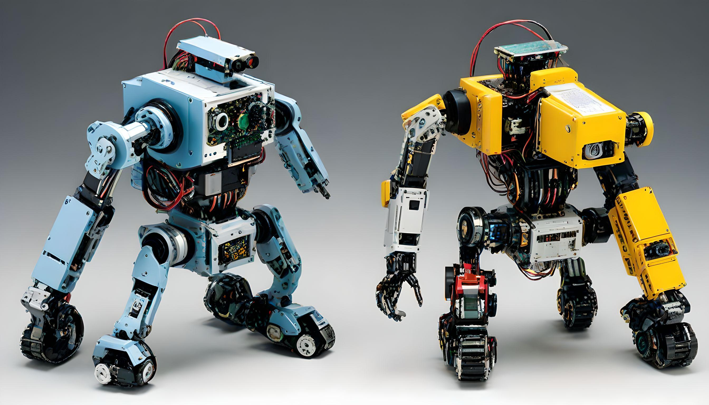

# Prompts para criar o conteúdo do módulo 04
## 1. Prompt para criação da aula 10 do módulo 04:
```
Comporte-se com um especialista em robótica e escreva o conteúdo da Aula 10: Projetos Simples de Robótica com Python do Módulo 4: Aplicações Práticas e Projetos
```
### Resultado:
Projetos simples de robótica são uma excelente maneira de aplicar conceitos de programação e engenharia, oferecendo oportunidades para praticar habilidades e experimentar com diferentes componentes. Nesta aula, vamos explorar alguns projetos simples de robótica que podem ser construídos e programados com Python. Vamos incluir instruções passo a passo, bem como o código Python necessário para cada projeto.

---

# Aula 10: Projetos Simples de Robótica com Python

## Objetivos da Aula
- Construir projetos simples de robótica usando Python.
- Aplicar conceitos básicos de programação e controle de robôs.
- Compreender como diferentes componentes interagem para criar robôs funcionais.

## 1. Introdução aos Projetos Simples de Robótica
Projetos simples de robótica são ideais para iniciantes e para quem deseja experimentar com construção e programação de robôs. Esses projetos geralmente envolvem componentes básicos, como motores, sensores e controladores, e podem ser programados com Python para realizar tarefas específicas.

## 2. Projeto 1: Robô Móvel com Controle por Bluetooth
Este projeto consiste em construir um robô móvel simples e controlá-lo remotamente usando Bluetooth.

### 2.1. Componentes Necessários
- Placa microcontroladora (como Arduino ou Raspberry Pi).
- Motores DC para mobilidade.
- Módulo Bluetooth para comunicação.
- Chassi para o robô (pode ser um kit ou feito à mão).
- Baterias para energia.

### 2.2. Construção do Robô Móvel
- Monte o chassi do robô e instale os motores DC.
- Conecte a placa microcontroladora aos motores e ao módulo Bluetooth.
- Certifique-se de que a bateria está conectada para alimentar o robô.

### 2.3. Programação do Robô com Python
Abaixo está um exemplo de código Python para controlar o robô por Bluetooth:

```python
import serial
import time

# Configuração do módulo Bluetooth
bluetooth = serial.Serial("COM3", 9600)  # Porta serial e taxa de transmissão

# Funções para controle do robô
def move_forward():
    bluetooth.write(b'F')  # Envia comando para mover para frente

def move_backward():
    bluetooth.write(b'B')  # Envia comando para mover para trás

def turn_left():
    bluetooth.write(b'L')  # Envia comando para virar à esquerda

def turn_right():
    bluetooth.write(b'R')  # Envia comando para virar à direita

# Teste dos comandos
move_forward()
time.sleep(2)  # Move para frente por 2 segundos
move_backward()
time.sleep(2)  # Move para trás por 2 segundos

bluetooth.close()  # Fecha a conexão Bluetooth
```

### 2.4. Teste e Controle Remoto
- Conecte seu dispositivo Bluetooth ao módulo Bluetooth do robô.
- Use um aplicativo ou código Python para enviar comandos ao robô e controlá-lo remotamente.
- Teste diferentes movimentos e ajuste conforme necessário.

## 3. Projeto 2: Braço Robótico Simples com Servomotores
Este projeto consiste em construir um braço robótico simples que pode ser controlado para mover objetos pequenos.

### 3.1. Componentes Necessários
- Placa microcontroladora (como Arduino ou Raspberry Pi).
- Servomotores para movimento do braço.
- Estrutura para o braço (pode ser feita com componentes LEGO ou materiais simples).
- Fonte de energia para os servomotores.

### 3.2. Construção do Braço Robótico
- Monte a estrutura do braço robótico, incluindo articulações para movimento.
- Instale os servomotores nas articulações para controle do movimento.
- Conecte os servomotores à placa microcontroladora.

### 3.3. Programação do Braço Robótico com Python
Aqui está um exemplo de código Python para controlar os servomotores do braço robótico:

```python
import RPi.GPIO as GPIO
import time

# Configuração do GPIO para os servomotores
servo_pin = 18  # Pino para controlar o servomotor
GPIO.setmode(GPIO.BCM)
GPIO.setup(servo_pin, GPIO.OUT)

# Controle do servomotor
servo = GPIO.PWM(servo_pin, 50)  # Frequência de 50 Hz para PWM
servo.start(0)

# Função para mover o braço para um determinado ângulo
def set_angle(angle):
    duty_cycle = angle / 18 + 2  # Cálculo do ciclo de trabalho para o ângulo
    servo.ChangeDutyCycle(duty_cycle)
    time.sleep(1)  # Tempo para o movimento
    servo.ChangeDutyCycle(0)  # Evita sobreaquecimento do motor

# Teste do braço robótico
set_angle(90)  # Mover para 90 graus
set_angle(45)  # Mover para 45 graus

servo.stop()  # Para o PWM
GPIO.cleanup()  # Limpa as configurações do GPIO
```

### 3.4. Teste e Ajuste do Braço Robótico
- Teste o movimento do braço robótico para garantir que os servomotores estão funcionando corretamente.
- Ajuste os ângulos conforme necessário para obter o movimento desejado.
- Experimente mover objetos pequenos usando o braço robótico.

## Conclusão
Nesta aula, construímos projetos simples de robótica com Python, como um robô móvel controlado por Bluetooth e um braço robótico com servomotores. Aprendemos a aplicar conceitos básicos de programação e controle de robôs para criar projetos funcionais. Esses projetos simples servem como base para explorar conceitos mais complexos de robótica em aulas futuras.

---

Se precisar de mais projetos ou exemplos para complementar esta aula, posso ajudar a criar conteúdo adicional ou sugerir atividades para aplicar conceitos de robótica com Python.

## 2. Prompt para gerar uma ilustração:
```
crie um prompt para ia generativa de imagens para gerar uma ilustração para Aula 10: Projetos Simples de Robótica com Python.
```
### Resultado:
Para criar uma ilustração para uma aula sobre projetos simples de robótica com Python, a imagem deve incluir exemplos práticos de projetos que podem ser construídos e programados com Python. Vamos criar um prompt para uma IA generativa de imagens que capture a essência desses projetos e destaque a simplicidade e versatilidade da robótica com Python.

---

### Prompt para IA Generativa de Imagens: Projetos Simples de Robótica com Python

Crie uma ilustração que represente projetos simples de robótica que podem ser construídos e programados com Python. A imagem deve incluir exemplos de robôs móveis e braços robóticos, mostrando como eles podem ser controlados e programados com Python. Incluir o seguinte:

1. **Robô Móvel com Controle por Bluetooth**:
   - Mostre um robô móvel simples com rodas ou esteiras, indicando como ele é controlado por Bluetooth.
   - Inclua elementos que sugerem a conexão entre um dispositivo Bluetooth (como um smartphone ou laptop) e o robô.
   - Demonstre como Python pode ser usado para controlar o movimento do robô.

2. **Braço Robótico Simples com Servomotores**:
   - Ilustre um braço robótico com servomotores, destacando sua capacidade de mover objetos ou realizar tarefas básicas.
   - Mostre diferentes ângulos de movimento do braço robótico, indicando o uso de Python para controlar os servomotores.
   - Inclua exemplos de como o braço robótico pode ser usado para mover ou manipular pequenos objetos.

3. **Ferramentas para Programação com Python**:
   - Mostre um laptop ou computador com código Python, sugerindo a programação dos projetos com Python.
   - Inclua placas microcontroladoras, como Arduino ou Raspberry Pi, conectadas aos componentes do robô.
   - Demonstre como o código Python pode ser usado para controlar os componentes do robô.

4. **Aplicações Práticas**:
   - Mostre algumas aplicações práticas para esses projetos simples de robótica, como robôs educativos ou projetos DIY.
   - Inclua exemplos de como esses projetos podem ser usados para aprendizado ou experimentação.

A ilustração deve ser clara e organizada, mostrando como projetos simples de robótica com Python podem ser construídos e programados. Use cores distintas para diferenciar os diferentes projetos e componentes, e destaque a simplicidade e versatilidade da robótica com Python.

---

Com esse prompt, a IA generativa de imagens deve ter informações suficientes para criar uma ilustração que represente projetos simples de robótica com Python, mostrando exemplos práticos e como Python é usado para programar e controlar esses projetos. Se precisar de ajustes ou mais detalhes, fico à disposição para ajudar a refinar o prompt.

## 3. Prompt para criação da aula 11 do módulo 04:
```
Comporte-se com um especialista em robótica e escreva o conteúdo da Aula 11: Projetos Avançados de Robótica com Python do Módulo 4: Aplicações Práticas e Projetos
```
### Resultado:
Projetos avançados de robótica com Python exploram conceitos mais complexos e usam tecnologias mais sofisticadas para construir robôs que executam tarefas desafiadoras. Nesta aula, vamos discutir projetos que envolvem maior integração de componentes, técnicas de programação avançadas e aplicações práticas mais elaboradas. A aula incluirá exemplos de projetos avançados, como robôs autônomos, braços robóticos industriais e robôs com inteligência artificial, com foco em como Python é usado para controlar e programar esses projetos.

---

# Aula 11: Projetos Avançados de Robótica com Python

## Objetivos da Aula
- Compreender a complexidade e os componentes necessários para projetos avançados de robótica.
- Aplicar técnicas de programação avançadas para controle de robôs com Python.
- Explorar exemplos de projetos avançados que utilizam conceitos de automação, inteligência artificial e integração de sensores.

## 1. Introdução aos Projetos Avançados de Robótica
Projetos avançados de robótica envolvem o uso de componentes mais complexos, integração de sistemas, e aplicação de técnicas de programação sofisticadas. Esses projetos exigem uma compreensão mais profunda da engenharia e do controle de sistemas robóticos, bem como do uso de Python para lidar com tarefas desafiadoras.

## 2. Projeto 1: Robô Móvel Autônomo com Python
Este projeto consiste em construir um robô móvel que pode se mover de forma autônoma em um ambiente, usando sensores para evitar obstáculos e Python para controle.

### 2.1. Componentes Necessários
- Placa microcontroladora (como Arduino ou Raspberry Pi).
- Motores para mobilidade e componentes para controle de direção.
- Sensores ultrassônicos ou infravermelhos para detecção de obstáculos.
- Baterias para alimentação.
- Estrutura para o chassi do robô.

### 2.2. Construção do Robô Móvel Autônomo
- Monte o chassi do robô e instale os motores e componentes de direção.
- Conecte os sensores ultrassônicos ou infravermelhos à placa microcontroladora.
- Certifique-se de que a fonte de energia está conectada para alimentar o robô.

### 2.3. Programação do Robô com Python
Para este projeto, o robô deve ser programado para se mover de forma autônoma, evitando obstáculos com base nos dados dos sensores.

```python
import RPi.GPIO as GPIO
import time

# Configuração do GPIO para motores e sensores
motor_pins = [17, 18]  # Pinos dos motores
sensor_trigger = 23  # Pino do sensor ultrassônico (trigger)
sensor_echo = 24  # Pino do sensor ultrassônico (echo)

GPIO.setmode(GPIO.BCM)
GPIO.setup(motor_pins, GPIO.OUT)
GPIO.setup(sensor_trigger, GPIO.OUT)
GPIO.setup(sensor_echo, GPIO.IN)

# Função para medir distância com o sensor ultrassônico
def measure_distance():
    GPIO.output(sensor_trigger, GPIO.HIGH)
    time.sleep(0.00001)
    GPIO.output(sensor_trigger, GPIO.LOW)

    start_time = time.time()
    while GPIO.input(sensor_echo) == 0:
        start_time = time.time()
    while GPIO.input(sensor_echo) == 1:
        end_time = time.time()

    duration = end_time - start_time
    distance = (duration * 34300) / 2  # Em centímetros
    return distance

# Função para mover o robô para frente
def move_forward():
    GPIO.output(motor_pins[0], GPIO.HIGH)
    time.sleep(1)
    GPIO.output(motor_pins[0], GPIO.LOW)

# Função para desviar de obstáculos
def avoid_obstacles():
    distance = measure_distance()
    if distance < 20:  # Se a distância for menor que 20 cm
        # Tomar uma ação para evitar o obstáculo
        GPIO.output(motor_pins[1], GPIO.HIGH)  # Virar para a direita
        time.sleep(1)
        GPIO.output(motor_pins[1], GPIO.LOW)

# Programa principal para o robô móvel autônomo
while True:
    move_forward()
    avoid_obstacles()  # Checar se há obstáculos
    time.sleep(1)  # Aguardar um tempo entre as ações

GPIO.cleanup()  # Limpa as configurações do GPIO após a execução
```

### 2.4. Teste do Robô Móvel Autônomo
- Teste o robô em um ambiente controlado para verificar se ele pode se mover de forma autônoma.
- Ajuste os parâmetros do código Python conforme necessário para melhorar a detecção de obstáculos e o controle de direção.
- Experimente adicionar outros sensores para maior precisão na navegação.

## 3. Projeto 2: Braço Robótico Industrial com Controle por Python
Este projeto consiste em construir um braço robótico mais avançado, com vários graus de liberdade, para simular um braço industrial controlado por Python.

### 3.1. Componentes Necessários
- Placa microcontroladora (como Arduino ou Raspberry Pi).
- Servomotores para controle de movimento do braço.
- Estrutura robusta para o braço, simulando um braço industrial.
- Fonte de energia suficiente para alimentar vários servomotores.

### 3.2. Construção do Braço Robótico Industrial
- Monte a estrutura do braço, incluindo várias articulações para maior flexibilidade.
- Instale os servomotores em cada articulação para controle de movimento.
- Conecte os servomotores à placa microcontroladora para controle por Python.

### 3.3. Programação do Braço Robótico com Python
O controle de um braço robótico com vários graus de liberdade requer código Python mais complexo para coordenar o movimento dos servomotores.

```python
import RPi.GPIO as GPIO
import time

# Configuração do GPIO para servomotores
servo_pins = [18, 23, 24]  # Pinos para cada servomotor
GPIO.setmode(GPIO.BCM)
for pin in servo_pins:
    GPIO.setup(pin, GPIO.OUT)

# Controle dos servomotores
servos = [GPIO.PWM(pin, 50) for pin in servo_pins]  # Configuração do PWM
for servo in servos:
    servo.start(0)

# Função para definir o ângulo dos servomotores
def set_angle(pin, angle):
    duty_cycle = angle / 18 + 2  # Cálculo do ciclo de trabalho para o ângulo
    servos[pin].ChangeDutyCycle(duty_cycle)
    time.sleep(1)  # Tempo para o movimento
    servos[pin].ChangeDutyCycle(0)  # Evitar sobreaquecimento do motor

# Teste de controle do braço robótico
set_angle(0, 90)  # Definir ângulo do primeiro servomotor
set_angle(1, 45)  # Definir ângulo do segundo servomotor
set_angle(2, 135)  # Definir ângulo do terceiro servomotor

# Parar o PWM e limpar os pinos GPIO
for servo in servos:
    servo.stop()
GPIO.cleanup() 
```

### 3.4. Teste do Braço Robótico Industrial
- Teste o braço robótico para garantir que todas as articulações estão funcionando corretamente.
- Ajuste os ângulos e a velocidade de movimento para obter resultados precisos.
- Experimente usar o braço para mover objetos ou realizar tarefas simuladas de um braço industrial.

## Conclusão
Nesta aula, exploramos projetos avançados de robótica com Python, como um robô móvel autônomo e um braço robótico industrial. Aplicamos técnicas de programação avançadas para controle de robôs e exploramos a complexidade envolvida em projetos mais sofisticados. Esses projetos avançados servem como base para aprender sobre automação, inteligência artificial e integração de sistemas na robótica.

---

Se precisar de mais exemplos ou ideias para projetos avançados de robótica com Python, posso ajudar a criar mais conteúdo ou sugerir atividades para aplicar conceitos de robótica em projetos mais complexos.

## 4. Prompt para gerar uma ilustração:
```
crie um prompt para ia generativa de imagens para gerar uma ilustração para Aula 11: Projetos Avançados de Robótica com Python
```
### Resultado:
Para criar uma ilustração para uma aula sobre projetos avançados de robótica com Python, a imagem deve incluir elementos que representem projetos mais complexos de robótica, mostrando como Python é usado para controlar e programar robôs avançados. Aqui está um prompt para uma IA generativa de imagens que destaca diferentes tipos de projetos avançados em robótica com Python.

---

### Prompt para IA Generativa de Imagens: Projetos Avançados de Robótica com Python

Crie uma ilustração que represente projetos avançados de robótica que podem ser programados com Python. A imagem deve incluir exemplos de projetos mais complexos, mostrando a integração de componentes e o uso de Python para controle e automação. Incluir o seguinte:

1. **Robô Móvel Autônomo com Python**:
   - Mostre um robô móvel avançado, como um robô de exploração ou um veículo autônomo.
   - Inclua elementos que indiquem autonomia, como sensores ultrassônicos ou câmeras para detecção de obstáculos.
   - Demonstre como Python é usado para programar o comportamento autônomo do robô.

2. **Braço Robótico Industrial com Controle por Python**:
   - Ilustre um braço robótico com múltiplos servomotores, destacando sua capacidade de movimento em várias direções.
   - Mostre como Python é usado para controlar os servomotores e definir posições precisas do braço robótico.
   - Inclua elementos que indiquem aplicações industriais, como manipulação de objetos ou montagem de componentes.

3. **Elementos de Programação Avançada**:
   - Mostre um laptop ou computador com código Python, sugerindo programação avançada para controle de robôs.
   - Inclua gráficos ou diagramas que representem algoritmos complexos usados para controle autônomo ou aprendizado de máquina.

4. **Aplicações Práticas de Projetos Avançados**:
   - Inclua exemplos de aplicações práticas para esses projetos avançados, como robôs industriais ou robôs de pesquisa.
   - Mostre como esses projetos podem ser usados para automação, inteligência artificial e integração de sistemas.

A ilustração deve ser clara e organizada, mostrando como projetos avançados de robótica podem ser construídos e programados com Python. Use cores distintas para diferenciar os diferentes projetos e componentes, e destaque a complexidade e a integração de sistemas na robótica avançada.

---

Com esse prompt, a IA generativa de imagens deve ter informações suficientes para criar uma ilustração que represente projetos avançados de robótica com Python, mostrando exemplos práticos e elementos de programação avançada. Se precisar de ajustes ou mais detalhes, estou por aqui para ajudar a refinar o prompt.

## 5. Prompt para criação da aula 12 do módulo 04:
```
Comporte-se com um especialista em robótica e escreva o conteúdo da Aula 12: Demonstração e Avaliação de Projetos do Módulo 4: Aplicações Práticas e Projetos
```
### Resultado:

A demonstração e avaliação de projetos é uma parte importante do processo educacional em robótica, pois permite aos alunos aplicar o conhecimento adquirido ao longo do curso e compartilhar suas criações. Nesta aula, vamos explorar como conduzir uma demonstração eficaz de projetos de robótica e quais critérios usar para avaliar o trabalho dos alunos. Além disso, abordaremos sugestões para apresentar projetos, incentivar a colaboração e fornecer feedback construtivo.

---

# Aula 12: Demonstração e Avaliação de Projetos

## Objetivos da Aula
- Fornecer um ambiente propício para a apresentação de projetos de robótica.
- Estabelecer critérios para avaliação dos projetos apresentados.
- Incentivar a colaboração e o aprendizado entre os alunos por meio de feedback construtivo.

## 1. Preparação para a Demonstração de Projetos
Antes da apresentação dos projetos, é importante garantir que todos os alunos estejam preparados e que o ambiente seja adequado para a demonstração. Aqui estão algumas etapas de preparação:

### 1.1. Espaço para Demonstração
- Garanta um espaço adequado para os alunos apresentarem seus projetos, com espaço suficiente para robôs se moverem e interação com o público.
- Certifique-se de que há equipamentos de apresentação, como projetores ou telas, se necessário.

### 1.2. Testes Pré-Demonstração
- Instrua os alunos a testar seus projetos antes da demonstração para garantir que tudo está funcionando corretamente.
- Incentive-os a trazer peças de reposição ou ferramentas para correções rápidas, caso necessário.

### 1.3. Estrutura da Apresentação
- Oriente os alunos sobre a estrutura da apresentação. Eles devem ser capazes de explicar o conceito do projeto, os componentes usados e como Python foi utilizado na programação.
- Recomende que eles demonstrem as funcionalidades do projeto, destacando os recursos mais interessantes ou desafiadores.

## 2. Demonstração de Projetos
Durante a demonstração, é importante manter a ordem e dar a todos os alunos tempo para apresentar seus projetos. Aqui estão algumas dicas para conduzir a demonstração:

### 2.1. Ordem das Apresentações
- Estabeleça uma ordem para as apresentações para manter o fluxo organizado.
- Deixe tempo suficiente para cada apresentação, incluindo perguntas e respostas.

### 2.2. Interação com o Público
- Incentive os alunos a interagir com o público durante a apresentação, explicando conceitos e respondendo a perguntas.
- Promova um ambiente de apoio, onde os alunos se sintam à vontade para compartilhar suas ideias.

### 2.3. Demonstração Prática
- Durante a apresentação, peça aos alunos para demonstrar o funcionamento do projeto.
- Se houver robôs móveis, garanta que o espaço seja seguro e que todos possam ver a demonstração.

## 3. Critérios para Avaliação dos Projetos
Após a demonstração, é importante avaliar os projetos de maneira justa e construtiva. Aqui estão alguns critérios a serem considerados na avaliação:

### 3.1. Criatividade e Originalidade
- Avalie a criatividade do projeto e a originalidade da ideia.
- Considere se o projeto é inovador ou se aborda um problema de maneira única.

### 3.2. Funcionalidade e Eficácia
- Avalie se o projeto funciona conforme o esperado e se realiza as tarefas para as quais foi projetado.
- Considere a eficácia e a eficiência do projeto na execução das tarefas.

### 3.3. Uso de Python e Componentes de Robótica
- Avalie o uso de Python na programação do projeto. Considere a complexidade e o nível de habilidade necessários para criar o código.
- Avalie a integração de componentes de robótica e se o projeto faz uso eficaz desses componentes.

### 3.4. Apresentação e Comunicação
- Avalie a capacidade do aluno de explicar o projeto de maneira clara e compreensível.
- Considere a interação com o público e a habilidade de responder a perguntas e fornecer detalhes adicionais.

## 4. Feedback e Melhoria Contínua
Após a avaliação, forneça feedback construtivo aos alunos para ajudá-los a melhorar. Aqui estão algumas dicas para fornecer feedback eficaz:

### 4.1. Feedback Positivo
- Comece por destacar os pontos fortes do projeto e o que foi bem feito.
- Mostre apreciação pelo esforço e criatividade dos alunos.

### 4.2. Sugestões para Melhoria
- Ofereça sugestões específicas para melhoria, identificando áreas onde o projeto poderia ser aprimorado.
- Encoraje os alunos a continuar explorando e aprimorando suas habilidades em robótica.

### 4.3. Incentivo à Colaboração
- Incentive os alunos a colaborar e compartilhar ideias para melhorar seus projetos.
- Promova a troca de conhecimentos e experiências entre os alunos.

## Conclusão
Nesta aula, abordamos a demonstração e avaliação de projetos de robótica. Discutimos como preparar o ambiente para a demonstração, critérios para avaliação e como fornecer feedback construtivo para ajudar os alunos a melhorar. Essas práticas são essenciais para criar um ambiente de aprendizado positivo e estimular o crescimento contínuo em robótica.

---

Se precisar de mais sugestões ou dicas para conduzir a demonstração e avaliação de projetos de robótica, estou por aqui para ajudar a criar conteúdo adicional ou fornecer conselhos sobre como tornar essa etapa mais eficaz e enriquecedora para os alunos.

## 6. Prompt para gerar uma ilustração:
```
crie um prompt para ia generativa de imagens para gerar uma ilustração para a Aula 12: Demonstração e Avaliação de Projetos.
```
### Resultado:
Para criar uma ilustração para uma aula sobre a arquitetura de robôs, você precisará incluir uma visão detalhada dos principais componentes que compõem um robô e algumas configurações típicas de robôs. Vamos criar um prompt para uma IA generativa de imagens que ajude a visualizar esses elementos.

---

### Prompt para IA Generativa de Imagens: Arquitetura de Robôs

Crie uma ilustração que represente a arquitetura de um robô, mostrando seus principais componentes e diferentes configurações. A imagem deve incluir uma visão geral de um robô desmontado ou um diagrama detalhado que destaque os seguintes elementos:

1. **Corpo ou Chassi**:
   - Mostre a estrutura física do robô, indicando onde os outros componentes são montados.
   - Pode ser feito de alumínio, aço, ou plástico, dependendo do tipo de robô.

2. **Atuadores**:
   - Ilustre atuadores como motores DC, motores de passo ou servos, conectados ao corpo do robô.
   - Indique como os atuadores movem partes do robô, como rodas, braços ou outras articulações.

3. **Sensores**:
   - Adicione sensores ao robô, como sensores de toque, ultrassônicos ou câmeras.
   - Mostre como esses sensores são usados para detectar o ambiente ao redor do robô.

4. **Controlador**:
   - Mostre um controlador ou microcontrolador (como um Arduino ou Raspberry Pi) no centro do robô.
   - Indique como o controlador se conecta aos atuadores e sensores para controlar o robô.

5. **Fonte de Energia**:
   - Ilustre uma fonte de energia, como uma bateria recarregável, indicando como ela alimenta o robô.
   - Pode incluir outras fontes de energia, como energia elétrica ou células solares.

6. **Sistema de Comunicação**:
   - Mostre como o robô se comunica com outros dispositivos, usando comunicação sem fio (como Wi-Fi ou Bluetooth) ou com fio (como USB ou UART).

7. **Diferentes Configurações de Robôs**:
   - Adicione pequenas ilustrações mostrando diferentes configurações de robôs, como robôs móveis com rodas ou esteiras, robôs articulados com braços, e robôs autônomos.

A ilustração deve ser clara e detalhada, com rótulos para cada componente. Use cores distintas para destacar cada parte do robô e dê uma aparência tecnológica moderna à imagem.

---

Com esse prompt, a IA generativa de imagens deve ter informações suficientes para criar uma ilustração que mostre a arquitetura de um robô, incluindo seus componentes principais e várias configurações típicas. Se precisar de ajustes ou mais detalhes, fico feliz em ajudar.



[***Voltar para Trinlha***](./trilha.md)<br>
[***Continuação do chat - Módulo 01***](modulo01.md)<br>
[***Continuação do chat - Módulo 02***](modulo02.md)<br>
[***Continuação do chat - Módulo 03***](modulo03.md)<br>
[***Continuação do chat - Módulo 04***](modulo04.md)<br>
